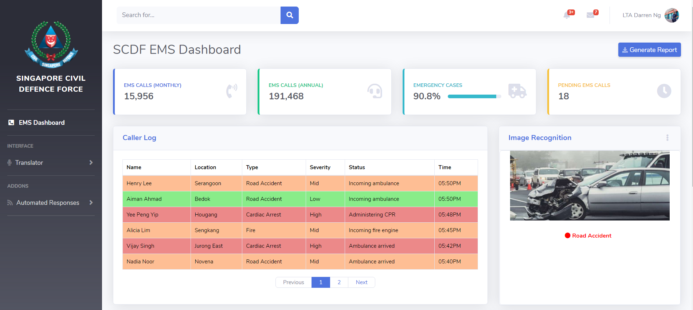
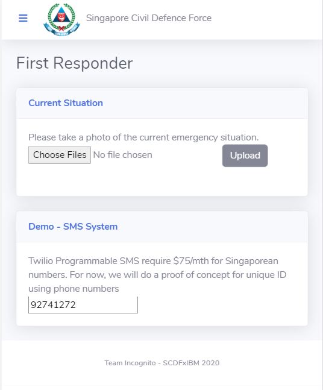

# Who are we?
Hi, we are Team Incognito, comprising of You Sheng, Qingyi, Joey and Chloe. We are currently year 1 students from Nanyang Technological University, studying Business and Computing.

# What’s the problem?

During traditional emergency voice calls, people may panic and it would take time to convey important information for SCDF Operators to dispatch. However, time is key in such emergencies and every second could make the difference between life and death.

# How can technology help?

Web technology, analytics and machine learning can be used for increased effectiveness in communication of detailed and reliable information for such emergency situations, which can help to minimise emergency response time.

# The idea

Waterfall is a web application which utilises IBM cloud’s machine learning and AI for effective relaying of information between responders and SCDF personnel to provide even faster emergency response time.

It consists of a responder mobile website and a SCDF personnel administrative website. In the case of an emergency, First Responders can opt to message 995, to receive a SMS link to our website, Waterfall.

Using Waterfall, instead of the traditional voice-call to relay information slowly, responders can upload photographs of the situation and provide geo-location tags from the mobile phone’s in-built GPS. By leveraging IBM cloud’s image recognition, images uploaded will be used to assess and immediately classify the emergency situation accurately in real-time.

These essential information will be clearly displayed as a dashboard on Waterfall for SCDF personnel. Waterfall will also provide helpful guides to responders and these guides are translated to multiple languages using the IBM Watson Translator. With the IBM Watson Text To Speech, these guides will be available in the form of both text and audio.

# The architecture of your proposed solution

1. The first responder navigates to the website and uploads a photo together with their geo-location tags using their mobile phone in-built GPS.
2. First responder is directed to helpful emergency guides which can be translated to multiple languages using IBM Watson Language Translator.
3. IBM Watson Text to Speech makes the guides available in the form of both text and audio.
4. IBM Watson Visual Recognition processes the uploaded image and immediately classifies the emergency situation which appears on the Web Dashboard for SCDF operators.

# Detailed description

[More details available here](https://github.com/GoldenCorgi/Incognito-Waterfall_SCDFXIBM/tree/master/detailed_description)

# Project Roadmap / Proposed timeline

Our group has developed a working prototype at the link given (Please contact us if the website is not up, as IBM Cloud Foundry Free Tier will stop running after a few days of inactivity. Some of the AI have API limits as well, do let us know if there are any issues with the features mentioned).

However, we faced several limitations due to the free tiers of the cloud technologies.

- IBM Watson - Free Tier Visual Recognition

The free tier only allowed for 1,000 images to be classified/trained, which gives us a very hard limit, as we are only able to train 500 images and leave the 500 for demo and prototyping purposes. With funding, we will be able to train the model on our entire dataset, which will further increase the accuracy of the image recognition system.

- Twilio SMS - Free Tier not inclusive of Singaporean numbers

The free tier does not allow SMS to numbers, and thus not available for development or prototyping. To purchase a Singaporean number for SMS purposes, they require $75/mth. In the future, we plan to make the website easily accessible via a SMS url link, therefore this will be in our projected roadmap.

- Google Maps - Free Tier Google Cloud Platform

We cannot access Google Maps API without adding billing. In the future, we plan to have a real-time updated map on the dashboard which will show the exact location of the responders. Google Maps API can also determine city names given the latitude and longitude that we are receiving from the GPS.

# Getting started / Usage Guide

There is no installation required for this application, as we aim to make it extremely accessible and quick for everyone to utilise, therefore we developed a website based application for both users.

**To get the most out of this application, it is preferable to use both a desktop and mobile at the same time.**

On your mobile, access the responder URL here: <https://scdf-incognito.us-south.cf.appdomain.cloud/responder>

On your desktop, access the SCDF Operator URL here: <https://scdf-incognito.us-south.cf.appdomain.cloud/>

The website dashboard is real-time, and will display changes made by the responders. (Do let us know if you want us to clean the history of the records for recording/demo purposes)

- Step 1 - As a responder, upload a picture of either a car crash accident, or a fire. You may also try to test the machine learning model by uploading a picture of normal traffic / high traffic.

- Step 2 - Submit the photo, it will load for a few seconds before bringing you (the responder) to another page with steps to follow to triage the incident.

- Step 3 - Access the website dashboard as the SCDF Operator. The record of the photo uploaded should reflect on the website. (Refresh if it hasn’t). As the operator, during periods of high traffic, you may choose to prioritise certain incidents with the limited resources by analysing the severity of the incidents using the photos uploaded. The AI model has also given a good prediction of what is the incident about (fire/car accident). 

# Live Demo / Links

## Websites

### Website Dashboard

<https://scdf-incognito.us-south.cf.appdomain.cloud/>

### Responder Website

<https://scdf-incognito.us-south.cf.appdomain.cloud/responder>

## Videos

### Pitch Demo

<http://www.youtube.com/watch?v=Q1LbVQgTQkU>

### Real-time Car Crash Recognition

<http://www.youtube.com/watch?v=0Owg8Iriz28>

# Technologies Used

Current Prototype:

- IBM Cloud Foundry
- Python - Flask
- IBM Visual Recognition
- IBM Language Translator
- IBM Cloudant

Planned Future:

- IBM Text To Speech
- Twilio
